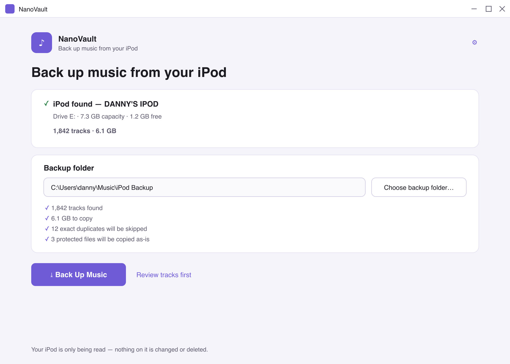

# NanoVault

**Back up the music on your iPod nano to a normal, organised folder on your PC — safely, and without ever changing the iPod.**

NanoVault detects a connected iPod, finds the music Apple hides inside `iPod_Control`, recovers real track names from embedded tags and the iPod's own database, and copies everything into a clean `Artist\Album\01 - Track Title.mp3` layout with SHA-256 verification, a backup report, and playlists. No iTunes required, no hidden-folder tricks, no command line.

**[⤓ Download for Windows](https://github.com/danielphelan92/nanovault/releases/latest)** · **[Website](https://danielphelan92.github.io/nanovault/)** · Free, MIT-licensed. If it saves your library, [buy me a coffee](https://paypal.me/NanoVault) ☕ (entirely optional).



*Design preview rendered from the app's actual theme; replace with a captured screenshot after the first Windows run.*

---

## What it does

1. Connect your iPod.
2. Open NanoVault — the device is detected automatically.
3. Choose a backup folder.
4. Click **Back Up Music**.
5. Get an organised, verified copy of your music, a playlist, and a report.

- **The iPod is strictly read-only.** NanoVault never writes to, renames on, deletes from, syncs, restores, or formats the device. Every file it opens on the iPod is opened with read-only access.
- Original audio bytes are copied exactly — never transcoded or "improved".
- Real names are recovered from embedded tags first, then from the iPod's `iTunesDB`, and tracks with no usable metadata are still saved under `Unknown Artist\Unknown Album\Unknown Track - <original name>`.
- Duplicates are never silently overwritten: identical files are skipped, different files with the same name get ` (2)`, ` (3)`, … names.
- Every copy is streamed through SHA-256 and re-verified after writing (on by default).
- Cancel or unplug at any time: finished tracks are kept, partial files are cleaned up, and backing up again resumes where it left off.

## Supported Windows versions

- Windows 10 22H2 (64-bit)
- Windows 11 (64-bit)

The app ships self-contained; no separate .NET installation is needed, and it installs per-user without administrator rights.

## Supported iPods

- **iPod nano (4th generation)** — primary target.
- **Best effort:** other classic disk-mode iPods (nano 1st–5th gen, iPod classic, mini, shuffle) that expose the standard `iPod_Control\Music` folder structure when mounted as a Windows drive. Detection uses several signals (folder structure, iPod database, volume label, removable-volume information), so a renamed volume label or unusual drive letter does not break it.
- **Not supported:** iPod touch / iPhone (they do not mount as disk drives), and the iPod nano 6th/7th generation when not exposed as a disk volume.

This build has been exercised against a synthetic iPod fixture that reproduces the 4th-generation nano's on-disk layout (including its iTunesDB). Testing against real hardware is recommended before relying on it for an irreplaceable library — see *Known limitations*.

Protected purchases (`.m4p`, `.aa`) are copied **as-is** and clearly labelled. NanoVault never attempts DRM removal; playback of protected files still requires the originally authorised Apple software/account.

## Install

Run `NanoVault-Setup-1.0.0.exe`, pick a folder (defaults to a per-user install, no admin prompt), and launch NanoVault from the Start menu. Uninstall normally from Windows Settings → Apps; your settings, logs, and music backups are never deleted by the uninstaller.

## Build from source

Prerequisites:

- [.NET 8 SDK](https://dotnet.microsoft.com/download/dotnet/8.0)
- PowerShell 7+ (`pwsh`) for the build scripts (plain `dotnet` commands work too)
- To compile the installer: [Inno Setup 6](https://jrsoftware.org/isinfo.php) on Windows, **or** NSIS 3.x on any OS

```powershell
git clone <repo-url>
cd NanoVault

# Build everything (Release)
pwsh build/build.ps1

# or directly:
dotnet build NanoVault.sln -c Release
```

The WPF app targets `net8.0-windows` but the whole solution also compiles on macOS/Linux (`EnableWindowsTargeting`), which is how cross-platform CI and packaging work.

## Run the tests

```powershell
pwsh build/test.ps1

# or directly:
dotnet test NanoVault.sln
```

167 tests cover detection scoring, path sanitisation, organisation templates, metadata merge precedence, defensive iTunesDB parsing (including deliberately corrupted databases), duplicate resolution, hashing, the copy engine (pause/cancel/verify/resume), playlists, reports, settings, end-to-end backups against a generated synthetic iPod, simulated device removal mid-copy, view-model state transitions, and a 10,000-track performance guard. Everything except the WPF views themselves runs cross-platform.

A ready-made fake iPod lives in [test-data/SyntheticIpod](test-data/SyntheticIpod) (regenerate with `dotnet run --project build/tools/FixtureGen`). All fixture audio is generated tones/silence — copyright-free.

## Package the installer

```powershell
pwsh build/package.ps1 -Version 1.0.0
```

This publishes the self-contained win-x64 build to `artifacts/publish/win-x64` and compiles `artifacts/NanoVault-Setup-1.0.0.exe` using Inno Setup (Windows) or NSIS (any OS). Both installer definitions live in `src/NanoVault.Installer/` and produce the same per-user installer: Start-menu shortcut, optional desktop shortcut, proper uninstall entry, icon and version info, and nothing else — no services, browser extensions, bundled software, or advertisements.

The published output is **not** IL-trimmed: trimming was not validated against TagLibSharp's and WPF's reflection use, and the spec forbids shipping trimming without that proof.

## Troubleshooting: the iPod does not appear

NanoVault shows this guidance in-app, too:

1. Unlock or wake the iPod (check the Hold switch).
2. Use a known-good Apple-compatible USB cable — charge-only cables cannot transfer data.
3. Plug into a USB port on the PC itself, not a hub.
4. Close iTunes or Apple Devices; either can hold the device open.
5. If supported, turn on **Enable disk use** in iTunes/Apple Devices so Windows mounts the iPod as a drive.
6. Reconnect and click **Scan Again**.

Never restore or erase the iPod to fix a connection problem — that deletes your music, and NanoVault will never ask for it.

## Privacy

NanoVault works entirely offline. No accounts, no ads, no analytics SDK, no telemetry, no artwork lookups, no uploads of any kind. The only things it creates are the installed app, local settings and logs under `%LOCALAPPDATA%\NanoVault` (logs kept 14 days), and the backup output in the folder you choose. Reports contain your music metadata (that's their job) and never device serial numbers.

## Known limitations

- **Not yet verified on real iPod hardware or a real Windows machine.** This release was built and tested on a non-Windows host: all 167 automated tests pass against a byte-accurate synthetic iPod, and the win-x64 build and installer are produced from scripted, repeatable steps — but install/launch/backup/uninstall on a clean Windows 10/11 VM (spec phase 8) and a real nano 4G remain to be executed. Treat the first real-device run as a validation step.
- The included screenshot is a design-accurate preview, not a capture of the running app, for the same reason.
- The installer is unsigned; Windows SmartScreen may warn on first run.
- Playlist recovery reads classic `iTunesDB` playlists; smart playlists are exported as their last materialised track list, and podcasts/videos/photos/games are out of scope for this release.
- `iTunesCDB` (compressed) databases are supported read-only; the very old `iTunesSD` (shuffle) format is not parsed, so shuffles fall back to embedded tags and fallback naming.
- One copy runs at a time by design (gentle on old flash controllers); this is not a speed-optimised bulk copier.

## Licence

[MIT](LICENSE). NanoVault is for backing up music you own or are authorised to copy.
